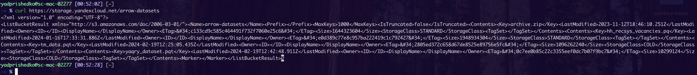
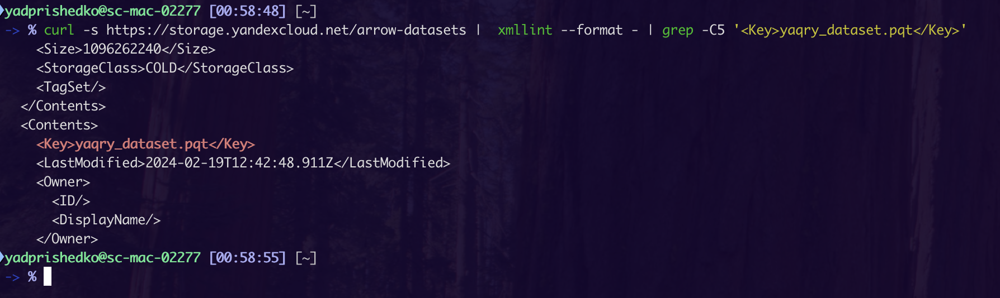
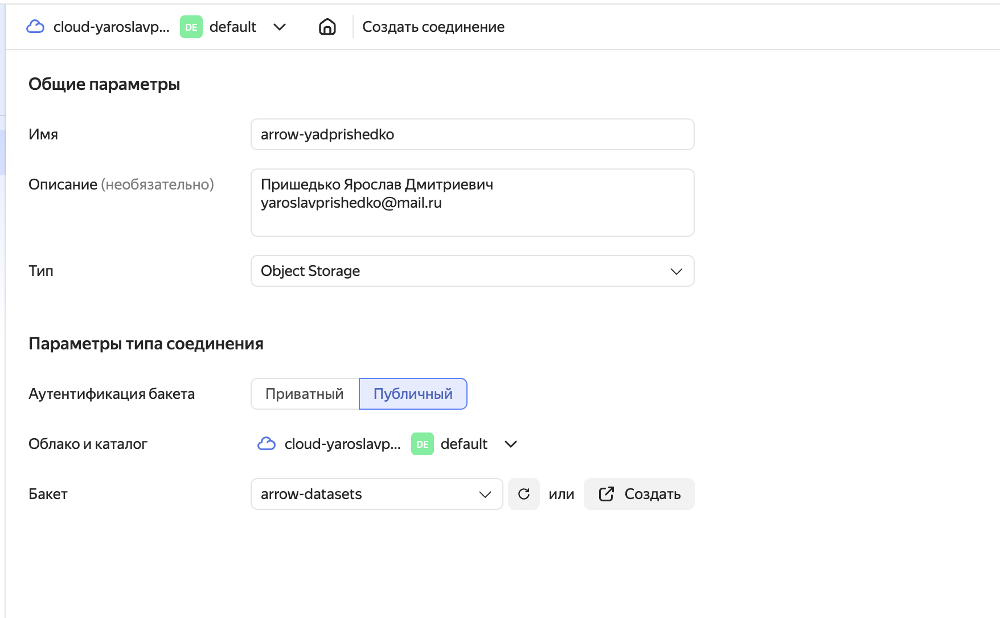
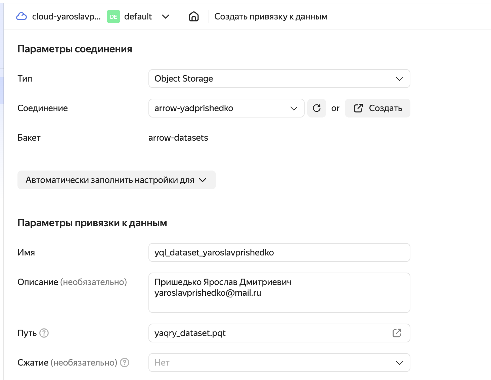
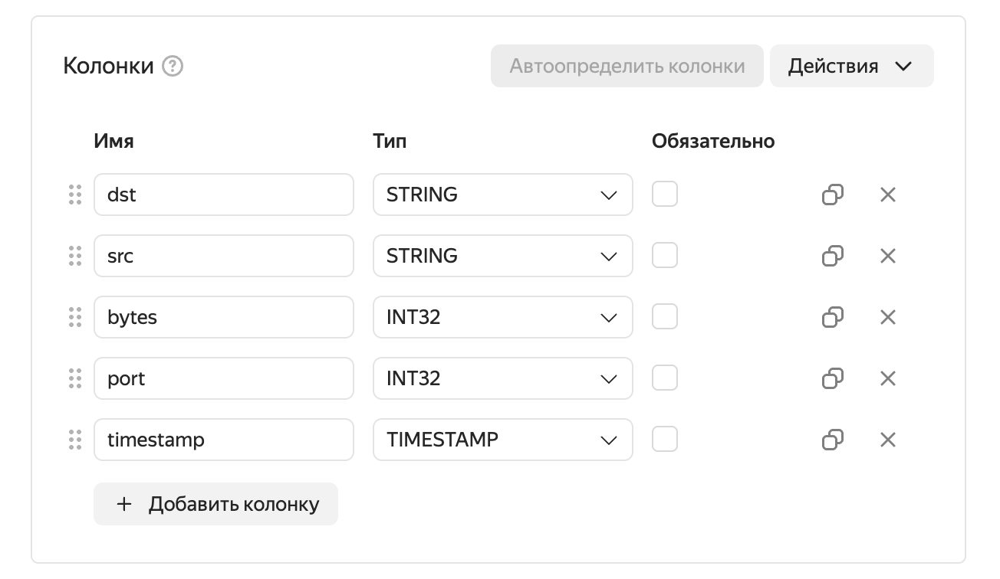
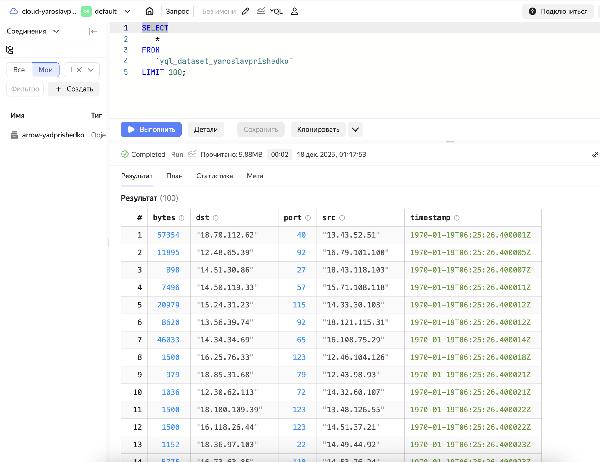
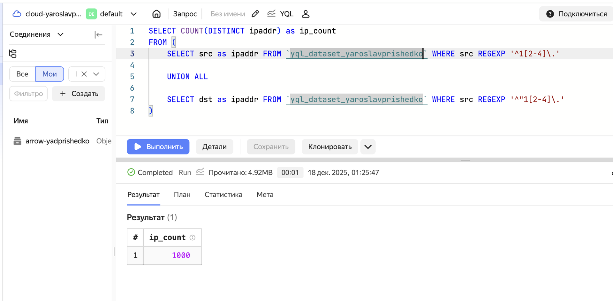
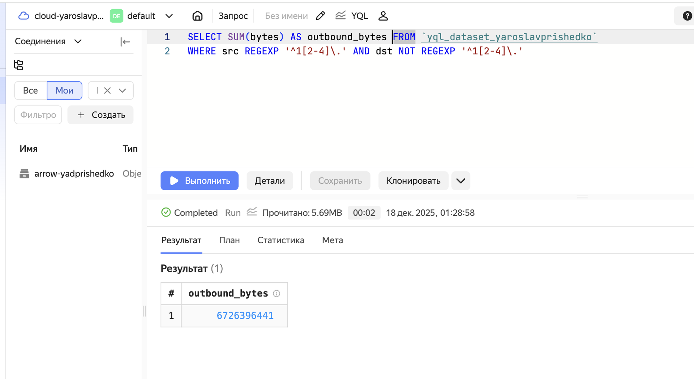
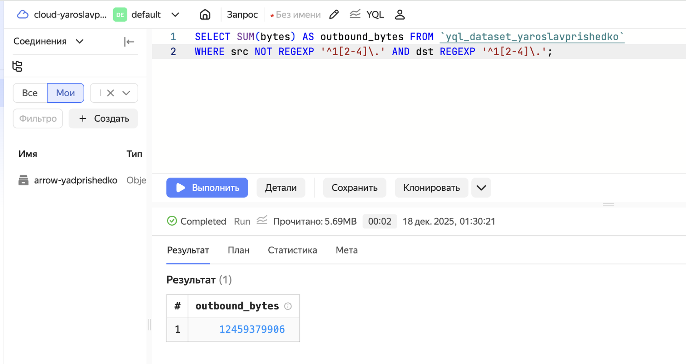

# Практическая работа №7. Использование технологии Yandex Query для анализа данных сетевой активности
yaroslavprishedko@yandex.ru

## Цель работы

1.  Изучить возможности технологии Yandex Query для анализа
    структурированных наборов данных
2.  Получить навыки построения аналитического пайплайна для анализа
    данных с помощью сервисов Yandex Cloud
3.  Закрепить практические навыки использования SQL для анализа данных
    сетевой активности в сегментированной корпоративной сети

## Исходные данные

1.  Программное обеспечение Windows 11
2.  Интерпретатор языка R v4.5.1
3.  Rstudio IDE
4.  Yandex Query

## Общая ситуация

Вам стали доступны данные сетевой активности в корпоративной сети
компании XYZ. Данные хранятся в Yandex Object Storage. Проведите
разведочный анализ данных и ответьте на вопросы

## Задание

Используя сервис Yandex Query настроить доступ к данным, хранящимся в
сервисе хранения данных Yandex Object Storage. При помощи
соответствующих SQL запросов ответить на вопросы

## Шаги

### 1. Проверить доступность данных в Yandex Object Storage

Проверим, что данные в бакете object storage доступны, удостоверимся в
публичном листинге айтемов бакета с помощью curl:

Удостоверимся в наличии файла `yaqry_dataset.pqt` с помощью curl:

Успешно удалось обнаружить файл `yaqry_dataset.pqt` в указанном
s3-бакете

### 2. Подключить бакет как источник данных для Yandex Query

Создаём соединение для публичного s3-бакета:

Создаем привязку данных к нужному файлу из бакета:

Выберем корректные колонки для отображения датасета в таблице:

Проверим через Yandex Query Language, что удается получить данные из
датасета с помощью привязки:

### Анализ

#### 1. Известно, что IP адреса внутренней сети начинаются с октетов, принадлежащих интервалу \[12-14\]. Определите количество хостов внутренней сети, представленных в датасете.

Для получения количества IP сделаем SELECT с фильтром на основе regex:

    SELECT COUNT(DISTINCT ipaddr) as ip_count
    FROM (
        SELECT src as ipaddr FROM `yql_dataset_yaroslavprishedko` WHERE src REGEXP '^1[2-4]\.'

        UNION ALL

        SELECT dst as ipaddr FROM `yql_dataset_yaroslavprishedko` WHERE src REGEXP '^"1[2-4]\.'
    )

#### 2. Определите суммарный объем исходящего трафика

Суммарный объем исходящего трафика можно найти прибегнув к фильтрам на
основе regex для src_ip и dst_ip. src должен входить во внутреннюю
подсеть, dst не должен входить

    SELECT SUM(bytes) AS outbound_bytes FROM `yql_dataset_yaroslavprishedko` 
    WHERE src REGEXP '^1[2-4]\.' AND dst NOT REGEXP '^1[2-4]\.'

#### 3. Определите суммарный объем входящего трафика

Суммарный объем исходящего трафика можно найти прибегнув к фильтрам на
основе regex для src_ip и dst_ip. src должен не входить во внутреннюю
подсеть, а dst должен входить

    SELECT SUM(bytes) AS outbound_bytes FROM `yql_dataset_yaroslavprishedko` 
    WHERE src NOT REGEXP '^1[2-4]\.' AND dst REGEXP '^1[2-4]\.';

## Вывод

В данной работе мы научились анализу данных используя скриптовый язык
Yandex Query Language на платформе Yandex Cloud
